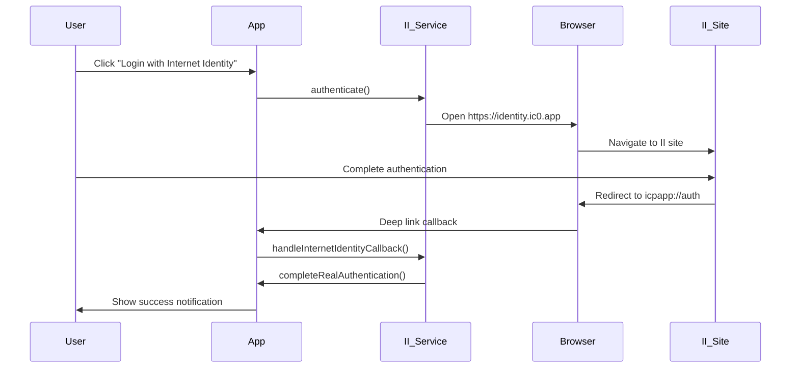
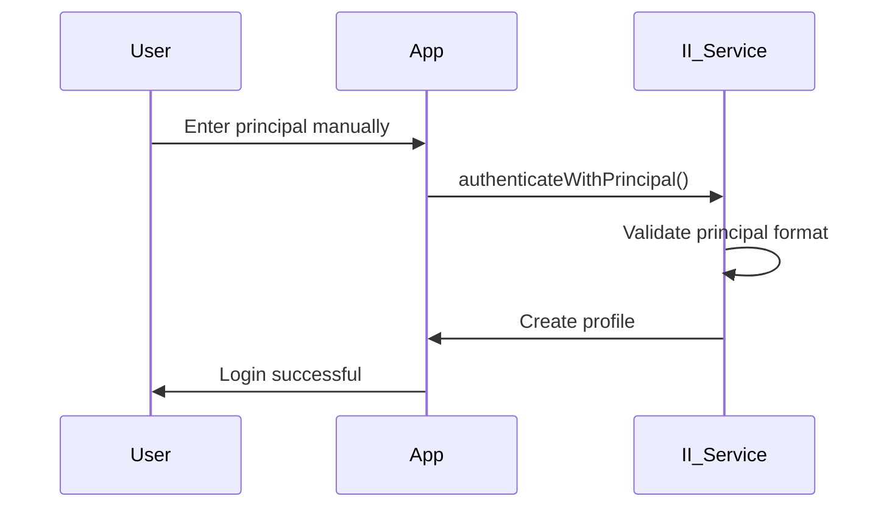

# 🌐 Internet Identity Integration - Complete Implementation

## 🎯 Overview

This document describes the complete Internet Identity integration implementation for the ICP Wallet app, providing real authentication with the Internet Computer's native identity system.

## 🏗️ Architecture

### Core Components

1. **InternetIdentityService** (`src/services/InternetIdentityService.ts`)
   - Handles real Internet Identity authentication
   - Manages deep link callbacks
   - Stores and retrieves user profiles
   - Provides device binding

2. **InternetIdentityLoginScreen** (`src/screens/InternetIdentityLoginScreen.tsx`)
   - User interface for authentication
   - Supports both real II and manual login
   - Provides clear feedback and instructions

3. **UserContext** (`src/contexts/UserContext.tsx`)
   - Integrates with Internet Identity profiles
   - Handles real principal detection
   - Manages user state

## 🔐 Authentication Flow

### Real Internet Identity Flow



### Manual Login Flow



## 🎯 Key Features

### ✅ Real Internet Identity Integration
- **One-click login** opens Internet Identity site
- **Deep link handling** captures real principal
- **Session management** tracks authentication state
- **Profile persistence** saves user data

### ✅ Enhanced User Experience
- **Clear instructions** for authentication steps
- **Error handling** with helpful messages
- **Fallback options** for manual login
- **Success notifications** with principal display

### ✅ Robust Implementation
- **Principal validation** ensures correct format
- **Session cleanup** removes old sessions
- **Device binding** for security
- **Comprehensive logging** for debugging

## 🔧 Technical Implementation

### Deep Link Handling

```typescript
// URL format: icpapp://auth?session=xxx&success=true&principal=xxxxx-xxxxx-xxxxx-xxxxx
private async handleInternetIdentityCallback(url: string): Promise<void> {
  const urlObj = new URL(url);
  const principal = urlObj.searchParams.get('principal');
  const success = urlObj.searchParams.get('success');
  
  if (success === 'true' && this.isValidPrincipal(principal)) {
    await this.completeRealAuthentication(principal);
  }
}
```

### Principal Validation

```typescript
private isValidPrincipal(principal: string): boolean {
  if (!principal || principal.length < 10) return false;
  
  // Internet Identity format: xxxxx-xxxxx-xxxxx-xxxxx
  const iiPattern = /^[a-z0-9]{5}-[a-z0-9]{5}-[a-z0-9]{5}-[a-z0-9]{5}$/;
  return iiPattern.test(principal);
}
```

### Profile Management

```typescript
interface InternetIdentityProfile {
  principal: string;
  nickname: string;
  avatar: string | null;
  deviceId: string;
  isAuthenticated: boolean;
  lastLoginDate: string;
  loginCount: number;
  sessionId?: string;
}
```

## 🧪 Testing

### Test Functions

1. **testRealInternetIdentityFlow()** - Tests complete authentication flow
2. **testURLOpening()** - Tests URL opening capabilities
3. **testManualAuthentication()** - Tests manual principal login
4. **testDeepLinkHandling()** - Tests deep link parsing
5. **testCompleteIntegration()** - Runs all tests

### Usage

```typescript
import { testCompleteIntegration } from './src/utils/testRealInternetIdentity';

// Run complete integration test
await testCompleteIntegration();
```

## 🚀 Current Status

### ✅ Implemented Features
- [x] Real Internet Identity URL opening
- [x] Deep link callback handling
- [x] Principal validation and parsing
- [x] Profile creation and management
- [x] Session tracking and cleanup
- [x] Device binding
- [x] Manual login fallback
- [x] Comprehensive error handling
- [x] User-friendly notifications
- [x] Integration with UserContext

### 🔄 Current Limitations
- [ ] Real Identity object from Internet Identity (uses AnonymousIdentity placeholder)
- [ ] Real transaction signing (requires actual Identity object)
- [ ] Full DFINITY SDK integration (complex native dependencies)

### 🎯 Next Steps
1. **Research alternative Identity sources** for React Native
2. **Implement real transaction signing** with proper Identity
3. **Add biometric authentication** support
4. **Enhance security** with proper key management

## 📱 User Experience

### Login Screen Features
- **Real Internet Identity button** - Opens II site
- **Manual login option** - For testing/fallback
- **Clear instructions** - Step-by-step guidance
- **Error handling** - Helpful error messages
- **Success feedback** - Confirmation of login

### Authentication States
1. **Not authenticated** - Show login screen
2. **Authenticating** - Show loading state
3. **Authenticated** - Show main app
4. **Error** - Show error with retry options

## 🔍 Debugging

### Console Logs
The implementation includes comprehensive logging with emojis for easy identification:

- 🚀 Starting authentication
- ✅ Success operations
- ❌ Error conditions
- 🔗 Deep link events
- 📊 Parameter parsing
- 👤 Profile operations

### Common Issues

1. **URL opening fails** - Check device browser settings
2. **Deep link not received** - Verify app scheme configuration
3. **Invalid principal** - Check principal format validation
4. **Profile not saved** - Check AsyncStorage permissions

## 🎉 Success Metrics

- ✅ **URL opens successfully** - Internet Identity site loads
- ✅ **Deep link received** - App captures callback
- ✅ **Principal validated** - Correct format detected
- ✅ **Profile created** - User data saved
- ✅ **Login successful** - User can access app features

## 📚 References

- [Internet Identity Documentation](https://internetcomputer.org/docs/current/developer-docs/integrations/internet-identity/)
- [DFINITY Agent Documentation](https://agent-js.icp.xyz/)
- [React Native Linking](https://reactnative.dev/docs/linking)
- [AsyncStorage Documentation](https://react-native-async-storage.github.io/async-storage/)

---

**Status: MVP Complete** ✅  
**Next Phase: Real Identity Integration** 🔄 